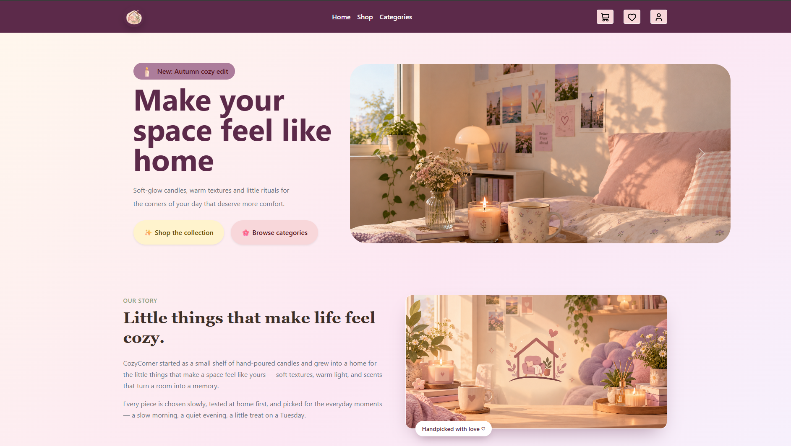
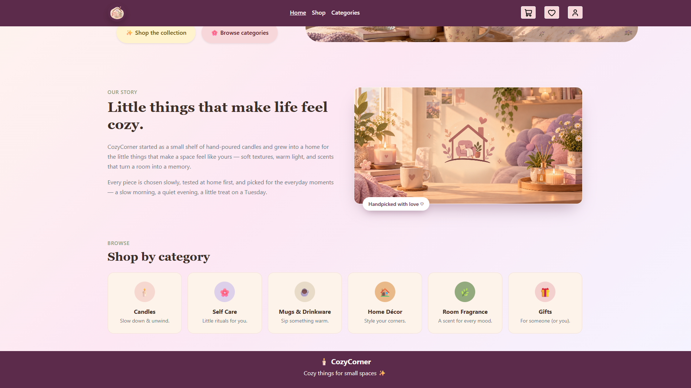
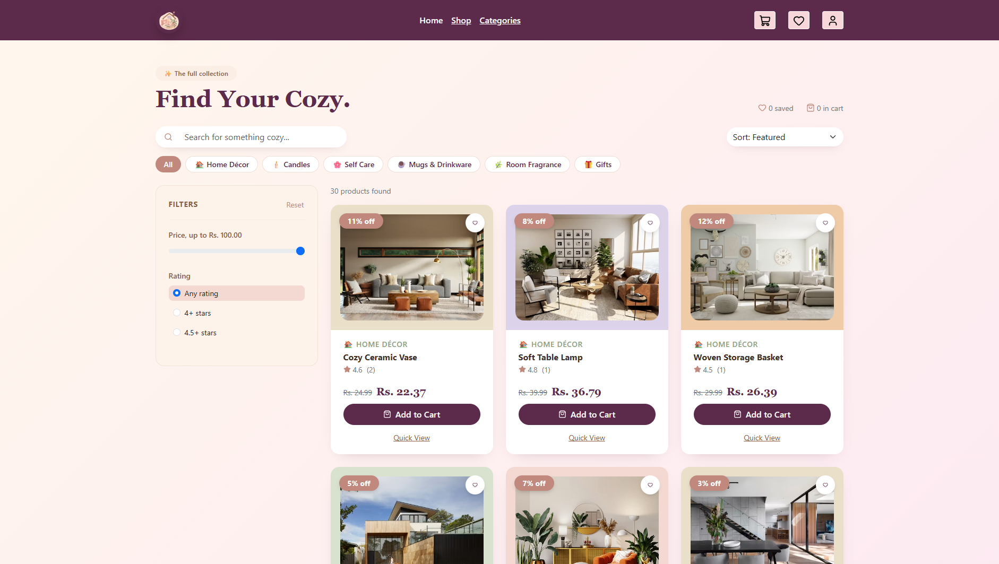
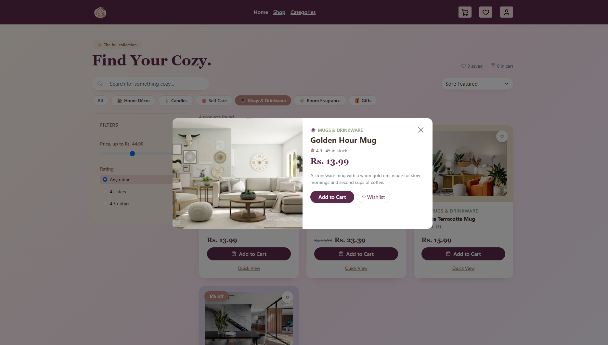
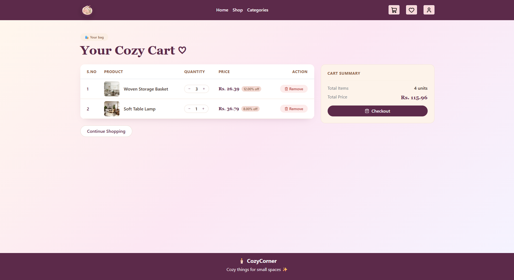
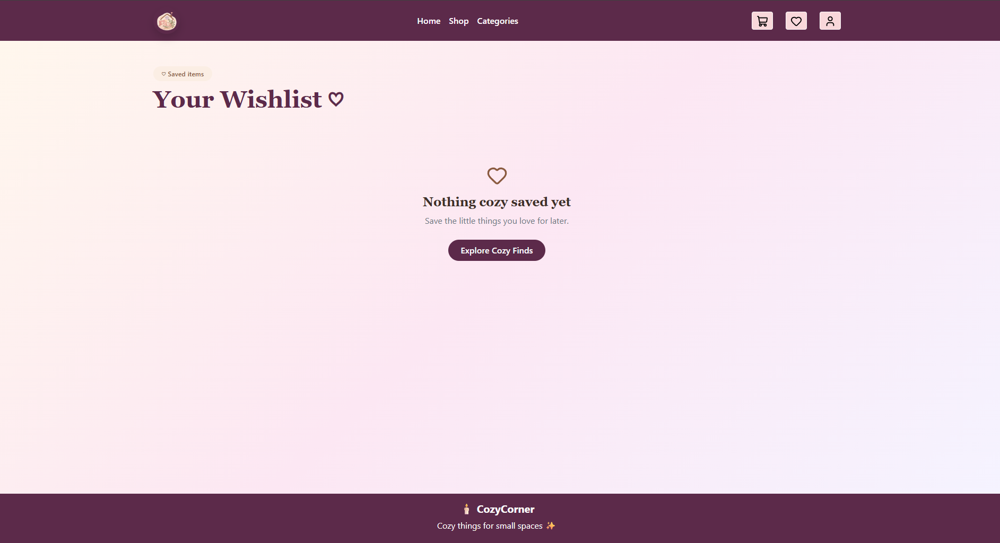
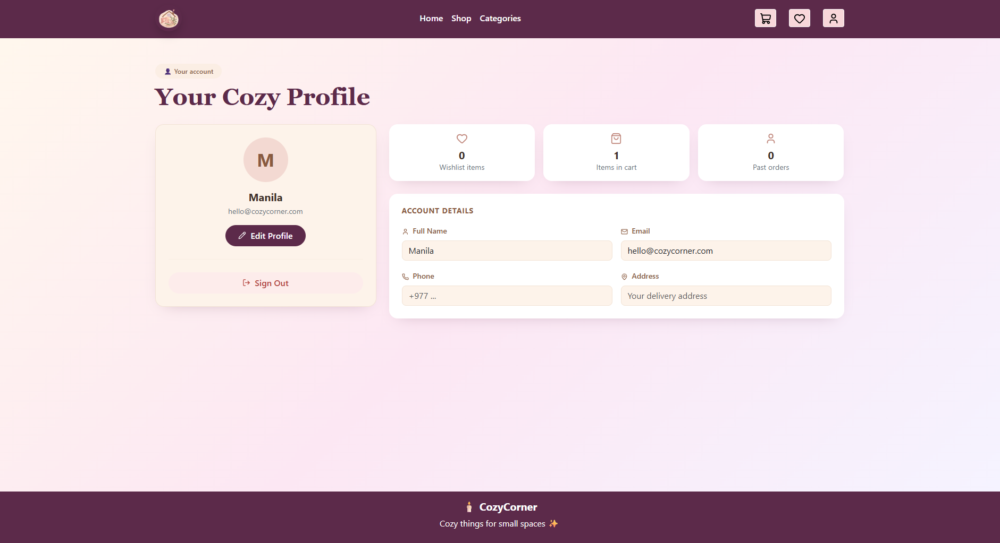

# 🕯️ CozyCorner – Home Décor E-Commerce Website

CozyCorner is a modern and user-friendly e-commerce website designed for browsing and shopping for home décor, candles, self-care products, mugs, fragrances, and gifts. The project is built using React and Vite, with product data loaded from a JSON API and interactive shopping features such as cart management, wishlist management, product filtering, and profile management.

---

## ✨ Features Implemented

- 🏠 **Home Page**
  - Attractive hero section
  - Promotional banner carousel
  - Our Story section
  - Shop-by-category section
  - Featured/recommended products
  - Responsive design

- 🛍️ **Shop Page**
  - Displays products fetched from JSON data using Axios
  - Product search functionality
  - Category filtering
  - Price filtering
  - Rating filtering
  - In-stock filtering
  - Product sorting
    - Featured
    - Price: Low to High
    - Price: High to Low
    - Highest Rated
    - Alphabetical
  - Product quick-view functionality
  - Add to Cart functionality
  - Add/remove products from Wishlist

- 🛒 **Shopping Cart**
  - View selected products
  - Increase or decrease product quantity
  - Remove products from cart
  - Calculate total items
  - Calculate total price
  - Continue shopping option
  - Cart data is stored using Local Storage

- ❤️ **Wishlist**
  - Save products to wishlist
  - Remove products from wishlist
  - Move wishlist products to cart
  - Wishlist data is stored using Local Storage

- 👤 **User Profile**
  - View profile information
  - Edit profile details
  - Save profile information
  - Display wishlist item count
  - Display cart item count
  - Sign-out interaction

- 🧭 **Navigation**
  - React Router based navigation
  - Home
  - Shop
  - Categories
  - Cart
  - Wishlist
  - Profile

- 🔔 **User Notifications**
  - SweetAlert2 notifications for cart and wishlist actions
  - Success and warning messages for user interactions

- 📱 **Responsive UI**
  - Responsive layout using Bootstrap
  - Mobile-friendly navigation
  - Responsive product cards and sections

---

## 🛠️ Technologies and Libraries Used

### Frontend

- **React.js** – Component-based user interface development
- **JavaScript (JSX)** – Application logic and UI components
- **HTML5** – Page structure
- **CSS3** – Custom styling
- **Bootstrap** – Responsive layout and UI components

### Libraries

- **React Router DOM** – Page routing and navigation
- **Axios** – Fetching product data from the JSON API
- **Lucide React** – Icons used throughout the application
- **SweetAlert2** – Interactive alerts and notifications

### Development Tools

- **Vite** – Development server and build tool
- **ESLint** – Code quality and linting
- **npm** – Package management

---

## 📂 Project Structure

```text
cozycorner/
│
├── public/
│   ├── b1.png
│   ├── b2.png
│   ├── b3.png
│   ├── logo.png
│   ├── story.png
│   └── cozycorner_home_decor.json
│
├── src/
│   ├── assets/
│   │   ├── bootstrap.bundle.min.js
│   │   ├── bootstrap.min.css
│   │   └── style.css
│   │
│   ├── components/
│   │   ├── Header.jsx
│   │   └── Footer.jsx
│   │
│   ├── pages/
│   │   ├── Homepage.jsx
│   │   ├── Shop.jsx
│   │   ├── Cart.jsx
│   │   ├── Wishlist.jsx
│   │   ├── Profile.jsx
│   │   └── Layout.jsx
│   │
│   ├── App.jsx
│   ├── Myroute.jsx
│   └── main.jsx
│
├── index.html
├── package.json
├── package-lock.json
├── vite.config.js
└── README.md
```

---

## 🚀 Setup Instructions

### 1. Clone or Download the Project

Download the CozyCorner project and open the project folder in Visual Studio Code or another code editor.

### 2. Open the Project Folder

Open the terminal inside the project root directory:

```bash
cd cozycorner
```

### 3. Install Dependencies

Run:

```bash
npm install
```

This installs all required dependencies listed in `package.json`.

### 4. Start the Development Server

Run:

```bash
npm run dev
```

Vite will start the development server and provide a local URL, usually similar to:

```text
http://localhost:5173/
```

Open the provided URL in a web browser to use the application.

### 5. Build the Project

To create a production build, run:

```bash
npm run build
```

To preview the production build locally:

```bash
npm run preview
```

---

## 🌐 Product Data

The product information is loaded from:

```text
public/cozycorner_home_decor.json
```

Axios is used to retrieve the product data and display it dynamically on the Home and Shop pages.

Example:

```javascript
axios.get("/cozycorner_home_decor.json").then((result) => {
  setProducts(result.data.products);
});
```

---

## 💾 Data Storage

CozyCorner uses **Browser Local Storage** for storing user-specific shopping information.

The following data is stored locally:

- Cart items
- Wishlist items
- Profile information

This allows cart, wishlist, and profile data to remain available when navigating between pages or refreshing the application in the same browser.

---

## 📸 Screenshots

### 1. Homepage





### 2. Shop Page





### 3. Cart / Wishlist / Profile







> **Note:** Add your actual screenshots of the running application inside a `screenshots` folder in the project root using these filenames:
>
> - `homepage.png`
> - `shop.png`
> - `cart.png`

Recommended structure:

```text
cozycorner/
├── screenshots/
│   ├── homepage.png
│   ├── shop.png
│   └── cart.png
│
├── src/
├── public/
├── package.json
└── README.md
```

---

## ⚠️ Known Limitations

- The project does not currently use a backend database.
- Product information is loaded from a local JSON file rather than a live e-commerce backend.
- Cart, wishlist, and profile information are stored in browser Local Storage.
- There is no real payment gateway integration.
- User authentication and account registration are not connected to a backend authentication system.
- The application does not currently process real orders or provide real order tracking.
- The profile page does not contain actual past order history.
- Product inventory is based on the available product data and is not connected to a real-time inventory system.

---

## 🎯 Project Objective

The main objective of CozyCorner is to develop a responsive and visually appealing e-commerce interface that provides users with a simple way to discover home décor and lifestyle products. The project demonstrates the use of React components, client-side routing, API/JSON data fetching, filtering and sorting, Local Storage, and responsive Bootstrap-based UI design.

---

## 👩‍💻 Project

**Project Name:** CozyCorner  
**Project Type:** E-Commerce Website  
**Frontend:** React.js  
**Build Tool:** Vite  
**Styling:** Bootstrap + CSS  
**Data Source:** Local JSON Product API
